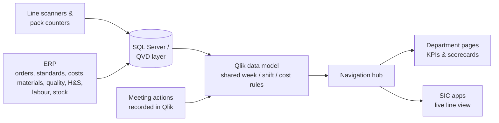

# Operations Governance Dashboard

**One Qlik app for operations performance, KPIs and scorecards across a food manufacturing site**

Built for a UK FMCG food manufacturer · Qlik Sense / Qlik Cloud · SQL Server · ERP · Line scanners and pack counters

> **About this repository**
> The screenshots, scripts and names here are generic and contain no real company data, connections or figures.
> The demo load script was prepared with the help of AI tools. The approach, data model, logic and KPIs are based on a live Operations Governance app I designed, built and rolled out.

---

## At a glance

| | |
|---|---|
| **What it is** | A single governance app that brings every operations department's KPIs, scorecards and reporting into one place, with a navigation hub linking to each area |
| **Who uses it** | Line leaders, department managers and the senior operations team |
| **Data** | Live production data from line scanners and pack counters, and ERP data (orders, standards, costs, materials, quality, H&S, stock) |
| **How it runs** | Fully automated with no spreadsheets. The only manual input is meeting actions, which are recorded directly in Qlik |

---

## The strategy

Every KPI is calculated automatically from the **source systems**:

1. **Live production data:** line scanners and pack counters give output by line, hour and shift.
2. **ERP data:** production orders, product standards and costs, material usage, yield and giveaway, quality (NCRs), health & safety incidents, labour and stock.
3. **Meeting actions:** the only manual input. Actions are recorded straight into Qlik during the meeting, with owner and due date.

There are no spreadsheets and no data entry to prepare reports. The same rules for **weeks, shifts and costs** are used on every page, so every figure matches wherever it appears.

---

## Navigation hub

Each button on the home screen opens the page for that department. Every page has buttons to move between pages and back to the hub.

| Button | What the page shows |
|---|---|
| **Productivity** | Recovered hours against worked hours, by area, shift and week |
| **Worked Hours** | Full-time and agency hours, planned cases, lines running, and discounted hours by reason (rework, training, trials, briefs) |
| **Recovered Hours** | Earned hours from production: quantity × standard cost ÷ standard labour rate |
| **Waste** | Material waste cost from closed production orders, by accounting group, area and line, with yield and giveaway variances |
| **Labour Standards** | Standard speeds, crew sizes and efficiency factors by product, used as the targets for the other pages |
| **Production** | Output, orders completed and quantities by area, line, SKU and shift |
| **Quality** | Non-conformance reports (NCRs) by category, area and shift, with quantity on hold and inventory value |
| **Live in Location** | Stock sitting in goods-in and hold locations, valued at standard cost, by area |
| **Audits** | Audit scores and trends |
| **SIC / SIC Area / SIC Factory** | Links to the Short Interval Control apps: the live hourly line view, an area view and a whole-factory view |

---

## KPIs and scorecards

| Area | Main KPIs |
|---|---|
| **Safety** | Incidents, injuries, lost-time incidents, reportable incidents |
| **Production** | Cases produced against plan, orders completed, output by line and shift |
| **Productivity** | Recovered hours, worked hours, discounted hours, productivity % = recovered ÷ (worked − discounted) |
| **Waste and yield** | Actual waste cost, waste variance, yield % against standard, giveaway (g and £), missed yield (£) |
| **Quality** | NCRs raised, category and sub-category, quantity and value on hold |
| **Engineering** | Breakdown minutes by area, planned maintenance (PPMs) completed, open items |
| **Stock** | Value of stock in goods-in and hold locations by area |
| **Governance** | Audit scores, orders waiting to close, open and overdue actions |

Each KPI is shown for **today, this week and last week**, with trends and status against target on the scorecards.

---

## How it works

- **One set of rules for weeks and shifts.** Weeks run Sunday to Saturday. Shifts are Day 07–15, Late 15–23 and Night 23–07. The weekend night shift is split at the week boundary so weekly totals are correct. These rules are defined once in the script and used by every table.
- **Productivity model.** Recovered hours come from production receipts at standard cost, and worked hours come from labour data. Both link to one **shift dimension** (area, date, shift), so hours are never double-counted across transactions.
- **Waste rules.** Only **closed manufacturing orders** are included. Recovered or reworked material that is a planned recovery is not counted as waste, and it is re-classified back to its original material group.
- **Quality text parsing.** NCR descriptions are recorded in a fixed format (category, sub-category, manufacturing yes/no, quantity, value). The script splits them into separate fields for reporting.
- **Config-driven.** Areas, stock locations and recovery codes are held in small config tables, so adding a new area means adding one row, not writing new code.

---

## Impact

- **Fully automated reporting** with no spreadsheets and no manual data preparation.
- **One version of the numbers** for every department, from line and shift level up to site level.
- **Every department in one place**, with navigation that lets managers move from a site figure down to the area, line and shift behind it.
- **Actions recorded and tracked in Qlik**, alongside the KPIs they relate to.

## My role

I designed and built the app from start to finish:

- worked with Operations, Finance, Engineering, Quality, H&S and HR to agree the KPIs, definitions and targets
- designed the data model and wrote the load scripts, bringing together live production and ERP data
- built the navigation hub, department pages, scorecards and drill-downs
- set up meeting actions to be recorded directly in Qlik
- trained managers and line leaders, and supported the rollout

## Tools and skills

`Qlik Sense` `Qlik Cloud` `SQL Server` `ERP data` `Data modelling` `ETL` `KPI design` `Scorecards` `Report automation` `Manufacturing KPIs` `Stakeholder management`

## What's in this repository

| Folder | Contents |
|---|---|
| `/qlik` | Generic load script and KPI definitions |
| `/Dashboard samples` | Screenshots with generic names and no real data |

---

**Jose Paul Irimpan** · Senior BI Analyst | Qlik, Power BI, SQL Server
[LinkedIn](https://www.linkedin.com/in/jose-paul-irimpan-a4331741/)
