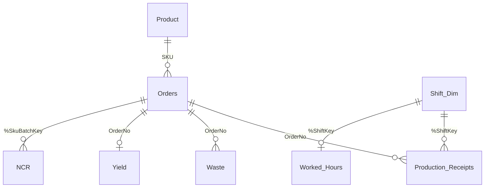

# Qlik files

| File | Description |
|---|---|
| `Governance_demo_load_script.qvs` | Load script for the demo app. Runs on the sample data in `/data` |
| `measures.md` | KPI definitions and Qlik expressions for each department page |

## Data model

Incidents, Engineering, Stock_In_Location, Actions and Audits are separate tables, each with their own area and week fields.

## Design choices

- **Shared rules.** Week, shift and "this week / last week" logic is defined once as variables and used by every table.
- **Shift dimension.** Production receipts and worked hours link through one shift table (area, date, shift). Hours are never repeated across transaction rows, so productivity totals are correct at any level.
- **Waste rules.** Only closed manufacturing orders. Planned recovery of reworked material is not counted as waste, and recovered material is re-classified to its original material group.
- **Text parsing.** Quality NCR descriptions are recorded in a fixed format and split into category, sub-category, operative, quantity and value.
- **Fixed "today" for the demo.** `vToday` is set to the last day of the sample data, so the current-week views always show figures. In a live app it is set to `Today()`.

## How to run it

1. In Qlik Sense or Qlik Cloud, create a new app.
2. Upload the CSV files from `/data` and create a folder data connection called **Governance_Demo**.
3. Paste the load script into the data load editor and click **Load data**.
4. Build the pages using the expressions in `measures.md`.
