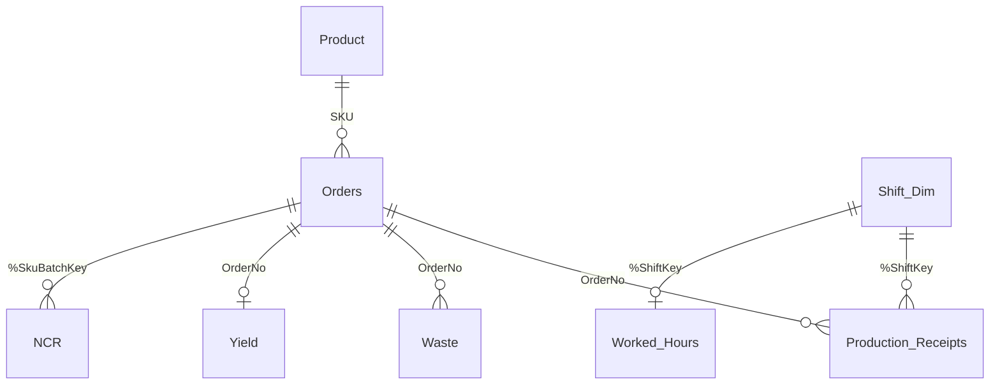
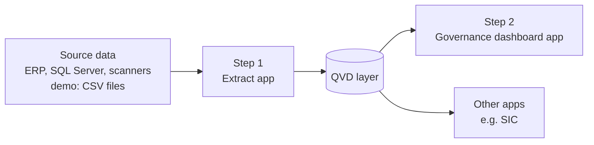

# Qlik files

| File | Description |
|---|---|
| `Governance_01_extract_to_qvd.qvs` | Step 1: reads each source table and stores it as a QVD file |
| `Governance_demo_load_script.qvs` | Step 2: the dashboard app. Loads only from the QVD files and builds the data model |
| `measures.md` | KPI definitions and Qlik expressions for each department page |

## Data model

Incidents, Engineering, Stock_In_Location, Actions and Audits are separate tables, each with their own area and week fields.

## Design choices

- **Shared rules.** Week, shift and "this week / last week" logic is defined once as variables and used by every table.
- **Shift dimension.** Production receipts and worked hours link through one shift table (area, date, shift). Hours are never repeated across transaction rows, so productivity totals are correct at any level.
- **Waste rules.** Only closed manufacturing orders. Planned recovery of reworked material is not counted as waste, and recovered material is re-classified to its original material group.
- **Text parsing.** Quality NCR descriptions are recorded in a fixed format and split into category, sub-category, operative, quantity and value.
- **Fixed "today" for the demo.** `vToday` is set to the last day of the sample data, so the current-week views always show figures. In a live app it is set to `Today()`.

## QVD architecture

The extract step runs first and stores every table as a QVD. The dashboard only reads QVDs, so reloads are fast and the same data can feed several apps.

## How to run it

1. Create a folder data connection called **Governance_Demo**. Upload the CSV files from `/data` into it, and create an empty sub-folder called **QVD**.
2. Create an app for step 1, paste `Governance_01_extract_to_qvd.qvs` and click **Load data**. This creates the QVD files.
3. Create the dashboard app, paste `Governance_demo_load_script.qvs` and click **Load data**.
4. Build the pages using the expressions in `measures.md`.
